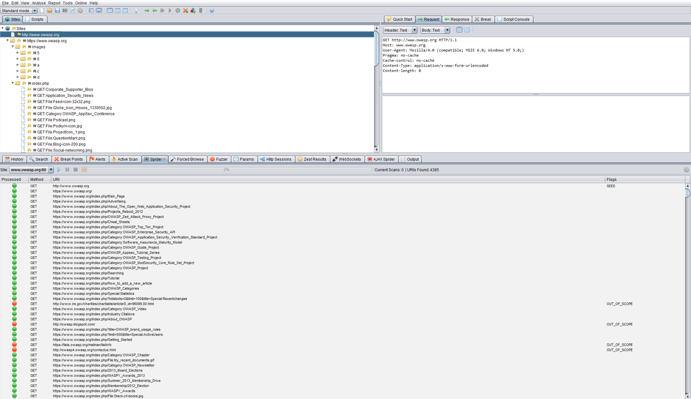

---

layout: col-document
title: WSTG - Latest
tags: WSTG

---


# Map Execution Paths Through Application

|ID          |
|------------|
|WSTG-INFO-07|

## Summary

Before commencing security testing, understanding the structure of the application is paramount. Without a thorough understanding of the application's layout, a comprehensive test is unlikely.

## Test Objectives

- Map the target application and understand the principal workflows.

## How to Test

In black-box testing, it is extremely difficult to test the entire codebase. This is not just because the tester cannot see the code paths through the application, but also because testing all the code paths would be extremely time-consuming. One way to reconcile this is to document the code paths that were discovered and tested.

There are several ways to approach the testing and measurement of code coverage:

- **Path** - test each of the paths through an application that includes combinatorial and boundary value analysis testing for each decision path. While this approach offers thoroughness, the number of testable paths grows exponentially with each decision branch.
- **Data Flow (or Taint Analysis)** - tests the assignment of variables via external interaction (normally users). Focuses on mapping the flow, transformation and use of data throughout an application.
- **Race** - tests multiple concurrent instances of the application manipulating the same data.

The choice of method and the extent to which each method is used should be negotiated with the application owner. Additionally, simpler approaches could be adopted. For example, the tester could ask the application owner about specific functions or code sections that they are particularly concerned about, and discuss how those code segments can be reached.

To demonstrate code coverage to the application owner, the tester can start by documenting all the links discovered from spidering the application (either manually or automatically) in a spreadsheet. The tester can then look more closely at decision points in the application and investigate how many significant code paths are discovered. These should then be documented in the spreadsheet with URLs, prose and screenshot descriptions of the paths discovered.

### Automatic Spidering

An automatic spider is a tool that is used to discover new resources (URLs) on a specific site automatically. It begins with a list of URLs to visit, called the seeds, which depends on how the Spider is started. While there are a lot of Spidering tools, the following example uses the [Zed Attack Proxy (ZAP)](https://github.com/zaproxy/zaproxy):

\
*Figure 4.1.7-1: Zed Attack Proxy Screen*

[ZAP](https://github.com/zaproxy/zaproxy) offers various automatic spidering options, which can be leveraged based on the tester's needs:

- [Spider](https://www.zaproxy.org/docs/desktop/start/features/spider/)
- [Ajax Spider](https://www.zaproxy.org/docs/desktop/addons/ajax-spider/)
- [OpenAPI Support](https://www.zaproxy.org/docs/desktop/addons/openapi-support/)

## Tools

- [Zed Attack Proxy (ZAP)](https://github.com/zaproxy/zaproxy)
- [List of spreadsheet software](https://en.wikipedia.org/wiki/List_of_spreadsheet_software)
- [Diagramming software](https://en.wikipedia.org/wiki/List_of_concept-_and_mind-mapping_software)

## References

- [Code Coverage](https://en.wikipedia.org/wiki/Code_coverage)
